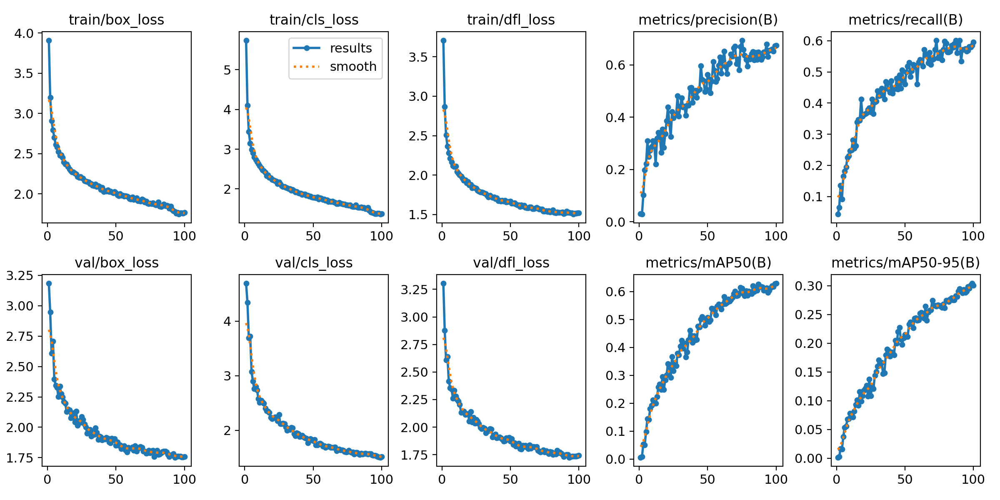
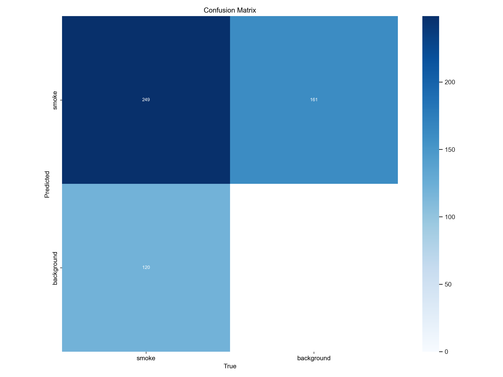
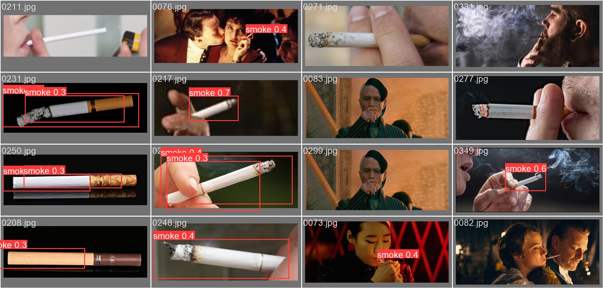
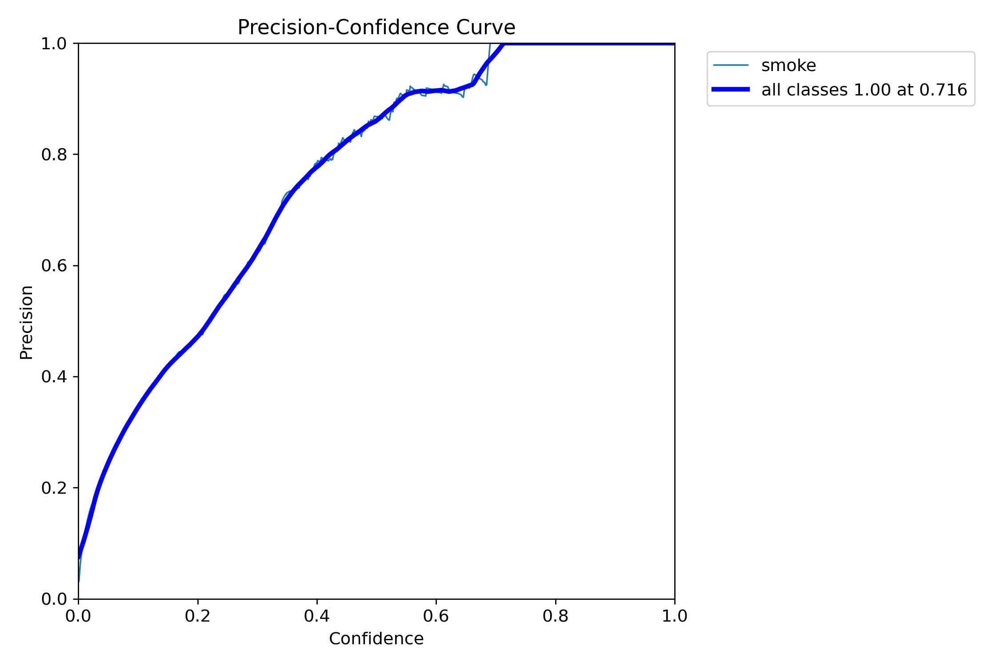

# YOLOv8 香烟/吸烟行为检测系统

公共场所的禁烟管理一直依赖人工巡查，效率低且容易遗漏。本项目基于 YOLOv8 训练了吸烟行为检测模型，同时集成了 CBAM 和 SE 两种注意力机制模块进行对比实验，并提供 PyQt5 桌面端和 Streamlit Web 端两套交互界面，支持图片、视频和摄像头实时检测。

## 痛点与目的

- **问题**：商场、医院、学校等禁烟场所的吸烟行为靠人工巡查难以全覆盖，视频监控系统没有自动识别能力
- **方案**：用 YOLOv8 在 smoke 数据集上训练吸烟检测模型，通过注意力机制（CBAM/SE）提升小目标检测精度，提供 GUI 和 Web 两种部署方式
- **效果**：模型可在监控视频中实时标注吸烟行为，mAP50 达到较高水平

## 实验结果

### 训练指标曲线



### 混淆矩阵



### 验证集预测效果



### PR 曲线



## 核心功能

- **YOLOv8 吸烟检测**：基于 ultralytics 框架训练的高精度检测模型
- **注意力机制对比**：集成 CBAM（通道+空间注意力）和 SE（通道注意力）模块，可对比不同注意力机制对检测性能的影响
- **PyQt5 桌面应用**：本地 GUI 界面，支持图片/视频/摄像头检测
- **Streamlit Web 应用**：浏览器端检测界面，无需安装客户端
- **多次实验记录**：保留 28+ 次训练实验结果，便于调参分析

## 使用方法

### 环境安装

```bash
pip install ultralytics streamlit
```

### Streamlit Web 检测

```bash
cd ultralytics-main/streamlit_app
streamlit run app.py
```

### PyQt5 桌面检测

```bash
cd ultralytics-main/pyqt
python bi.py
```

### 训练模型

```bash
cd ultralytics-main
yolo detect train data=dataset/smoke/data.yaml model=yolov8n.pt epochs=100
```

## 注意力模块说明

| 模块 | 原理 | 对应实验 |
|------|------|---------|
| CBAM | 通道注意力 + 空间注意力双重加权 | train26-CBAM |
| SE | 全局平均池化 → FC → Sigmoid 通道加权 | train27-SE |
| 基线 | 原始 YOLOv8n 无注意力模块 | train23-YOLOV8 |

## 项目结构

```
ultralytics-main/
├── ultralytics/              # YOLOv8 核心框架代码
├── dataset/smoke/            # 吸烟检测数据集
│   ├── images/               # 训练/验证/测试图片
│   ├── labels/               # YOLO 格式标注
│   └── data.yaml             # 数据集配置
├── runs/detect/              # 训练实验结果
│   ├── train23-YOLOV8/       # YOLOv8 基线实验
│   ├── train26-CBAM/         # CBAM 注意力实验
│   └── train27-SE/           # SE 注意力实验
├── pyqt/                     # PyQt5 桌面界面
├── streamlit_app/            # Streamlit Web 界面
├── yolov8n.pt                # 预训练权重
└── requirements.txt          # 依赖列表
```

## 适用场景

- 公共场所禁烟区域智能监控
- 校园/医院吸烟行为自动检测
- 注意力机制在目标检测中的对比研究
- YOLOv8 模型调参与实验管理

## 技术栈

| 组件 | 技术 |
|------|------|
| 目标检测 | YOLOv8 (ultralytics) |
| 注意力机制 | CBAM, SE |
| 桌面界面 | PyQt5 |
| Web 界面 | Streamlit |
| 深度学习 | PyTorch |
| 图像处理 | OpenCV |

## 许可证

MIT 许可证
